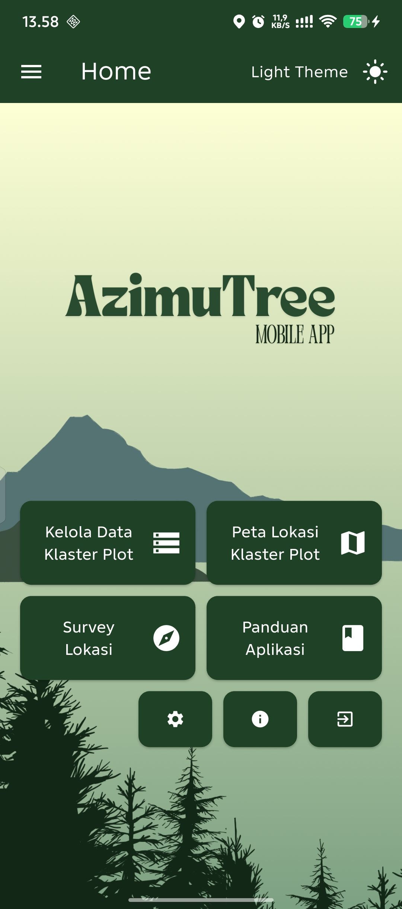
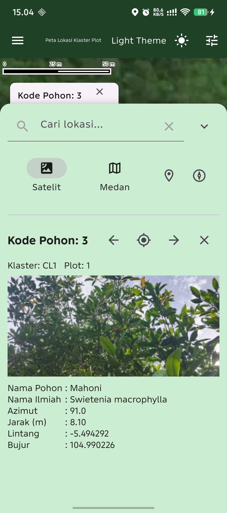
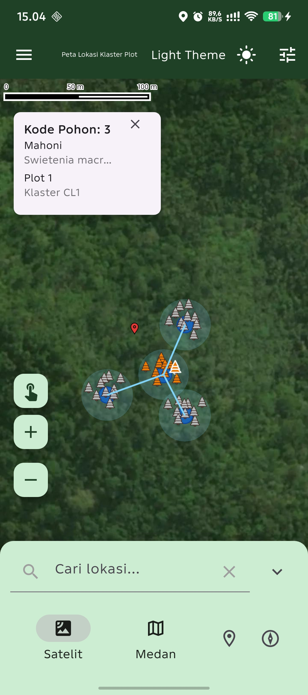
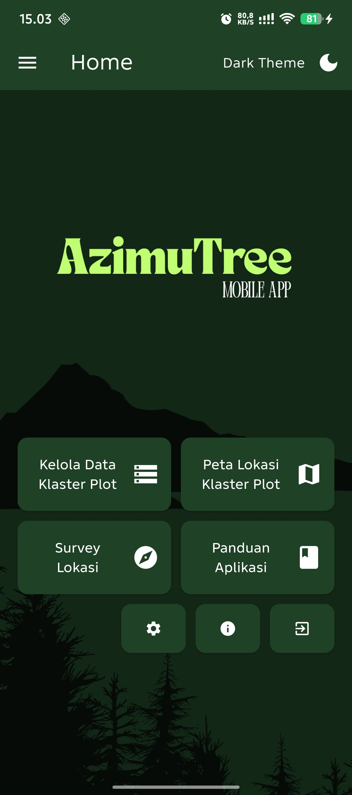
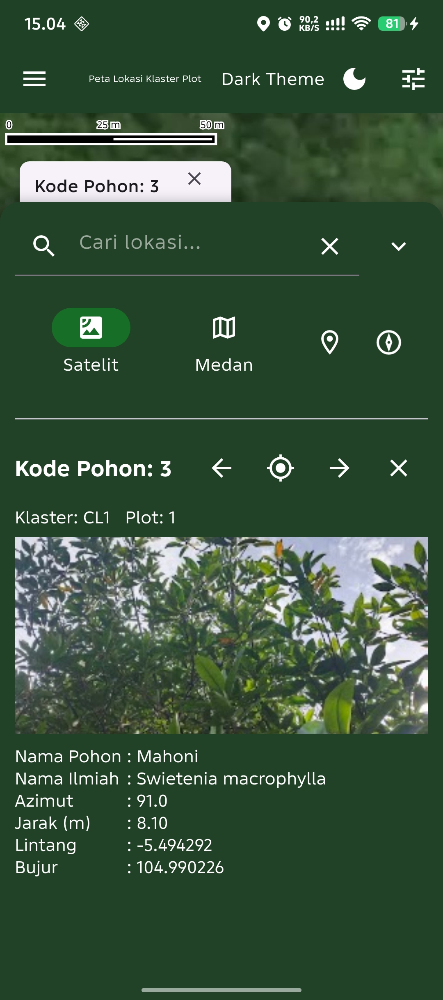

## Tentang Aplikasi

**Azimutree** adalah aplikasi Android untuk membantu kegiatan **pemantauan kesehatan hutan** dengan metode **Forest Health Monitoring (FHM)**. Aplikasi ini mencatat lokasi Titik Ikat, klaster, plot, dan pohon, lalu menampilkannya pada peta digital. Fitur radar dan kompas membantu pengguna menemukan lokasi survei di lapangan dengan lebih mudah.

## Latar Belakang

Dalam penelitian kesehatan hutan, kondisi lingkungan dapat berubah dari waktu ke waktu akibat faktor internal maupun eksternal. Perubahan ini sering menyebabkan **lokasi klaster plot hasil penelitian terdahulu** mengalami perbedaan kondisi vegetasi dan lingkungan, sehingga menyulitkan peneliti saat melakukan pengamatan lanjutan.

Permasalahan semakin kompleks karena pengamatan kesehatan hutan dilakukan secara **berkala** dan tidak jarang melibatkan **peneliti yang berbeda**. Meskipun data penelitian sebelumnya biasanya menyertakan koordinat lokasi, data tersebut umumnya masih disimpan dalam bentuk **file Excel**, sehingga kurang praktis untuk digunakan langsung di lapangan.

## Konsep Klaster Plot

Dalam metode Forest Health Monitoring, satu **klaster** terdiri dari beberapa **plot**, dengan ketentuan:

- Satu klaster maksimal memiliki **4 plot**.
- **Plot 1** berfungsi sebagai **sentroid (pusat klaster)**.
- Plot lainnya mengelilingi plot pusat.
- Setiap plot terdiri dari beberapa pohon terpilih yang merepresentasikan kondisi kesehatan hutan.

Struktur ini penting untuk memastikan konsistensi dan akurasi data dalam setiap periode penelitian.

## Fitur Utama

Beberapa fitur utama yang tersedia dalam aplikasi Azimutree antara lain:

- Pengelolaan data **Titik Ikat, klaster, plot, dan pohon** secara lokal.
- Input posisi menggunakan **azimut dan jarak** atau **lintang dan bujur**.
- Pemilihan koordinat secara visual melalui peta Mapbox.
- Visualisasi marker, area plot, garis relasi, dan lokasi pengguna pada peta digital.
- **Survey Lokasi** dengan panduan GPS, kompas, dan radar pohon.
- Sesi survey persisten sehingga dapat dilanjutkan setelah kembali ke Beranda.
- **Impor dan ekspor beberapa klaster** melalui file Excel.
- **Penyimpanan Awan Firebase** untuk berbagi data penelitian tanpa file Excel.
- Data publik dapat dicari dan diunduh tanpa login.
- Login Google opsional untuk mengunggah serta mengelola data milik sendiri.
- Dukungan tema terang dan gelap.

## Screenshots

<p align="center">
  <strong>Light mode</strong>
</p>

<p align="center">
  
  
  
</p>

<p align="center">
  <strong>Dark mode</strong>
</p>

<p align="center">
  
  
  
</p>

## Tujuan Aplikasi

Azimutree dikembangkan untuk menjawab kebutuhan peneliti kesehatan hutan dalam:

- Memvisualisasikan **titik koordinat klaster dan plot** pada peta digital.
- Mempermudah peneliti menemukan kembali **lokasi penelitian sebelumnya** di lapangan.
- Mengurangi kesalahan penentuan posisi plot akibat perubahan kondisi hutan.

Aplikasi ini berfokus pada **pencatatan, visualisasi, dan navigasi lokasi**, bukan pada pencatatan detail nilai kesehatan pohon atau hutan.

## Teknologi yang Digunakan

Azimutree dikembangkan menggunakan teknologi berikut:

- **Flutter** sebagai framework pengembangan aplikasi.
- **SQLite** untuk penyimpanan data lokal.
- **Mapbox** untuk pemetaan dan visualisasi lokasi.
- **Firebase Authentication** untuk login Google secara opsional.
- **Cloud Firestore** sebagai backend penyimpanan dan berbagi data penelitian, status layanan, profil pengguna, serta catatan versi aplikasi.

## Manfaat

Dengan menggunakan Azimutree, peneliti dapat:

- Lebih mudah melakukan pengamatan ulang di lokasi yang sama pada periode penelitian berikutnya.
- Menghemat waktu pencarian lokasi klaster dan plot di lapangan.
- Berbagi data lokasi penelitian secara lebih praktis dan terstruktur.
- Mengakses data penelitian publik dan menyimpan data sendiri melalui layanan awan.

## Penutup

Azimutree diharapkan dapat menjadi alat bantu yang efektif bagi peneliti kesehatan hutan dalam menjaga **konsistensi lokasi penelitian**, serta mendukung keberlanjutan pengamatan kondisi hutan dari waktu ke waktu.

<p style="font-size: 12px; color: #666;">
    MIT License © 2026 Asid
  </p>

---

## Instalasi Untuk Pengembangan

> **Catatan:** bagian ini khusus ditujukan untuk pengembang yang ingin menjalankan atau mengembangkan aplikasi secara lokal.

Clone repositori:

```bash
git clone https://github.com/asid30/azimutree-flutter.git
```

Install dependencies:

```bash
flutter pub get
```

**Penting:**

Akses token Mapbox diperlukan untuk fitur peta. Dapatkan token di https://www.mapbox.com/.

Gunakan `env_template` yang sudah ada — salin dan ubah namanya menjadi `.env`, lalu isi nilai `MAP_BOX_ACCESS` di file `.env`:

```bash
cp env_template .env
# lalu buka .env dan isi:
# MAP_BOX_ACCESS=pk.your_mapbox_public_token_here
```

Pastikan **tidak** meng-commit `.env` ke repo (file template tetap di-repo). Aplikasi membaca nilai ini melalui `flutter_dotenv` dan kode menggunakan variabel `MAP_BOX_ACCESS`.

### Konfigurasi Firebase

Proyek Firebase diperlukan untuk fitur Penyimpanan Awan, login Google, pemeriksaan status layanan, dan catatan versi aplikasi.

1. Instal Firebase CLI dan FlutterFire CLI.
2. Login ke Firebase lalu hubungkan aplikasi dengan proyek Firebase:

```bash
firebase login
flutterfire configure --project=YOUR_FIREBASE_PROJECT_ID
```

3. Aktifkan **Google** pada Firebase Authentication → Sign-in method.
4. Buat database Cloud Firestore.
5. Terapkan Security Rules yang tersedia di [`firestore.rules`](firestore.rules):

```bash
firebase deploy --only firestore:rules --project YOUR_FIREBASE_PROJECT_ID
```

6. Buat dokumen `system/status` dengan field berikut agar pemeriksaan layanan berhasil:

```text
cloudEnabled: true
message: "Aplikasi berhasil terhubung ke layanan penyimpanan awan."
```

Catatan versi disimpan pada koleksi `appVersions`. Setiap dokumen yang ingin ditampilkan harus memiliki `isPublished: true`.

Jalankan aplikasi:

```bash
flutter run
```

> Aplikasi ini hanya dikembangkan untuk perangkat mobile Android.
